### Quick Navigation
* Click the link to go to specific heading

  * [Downloading Zip File](#Download-and-start-installation)

  * [Installation](#Run-setup-file)

  * [User creation](#User-creation)

  * [Dropping user](#Dropping-user)

  * [Demo Queries](#Demo-Queries)

  * [Writing real queries](#Writing-real-queries)

 
<!-- ------------------------------------------- -->

---

### Download and start installation

* Use SJCET college mail, go to drive and download the [zip_file](https://drive.google.com/drive/folders/16MCEMFbHjtlix31bOx_wI8adU1nD5j2j)

* No need to extract the zip, just open and double-click the 'setup.exe'

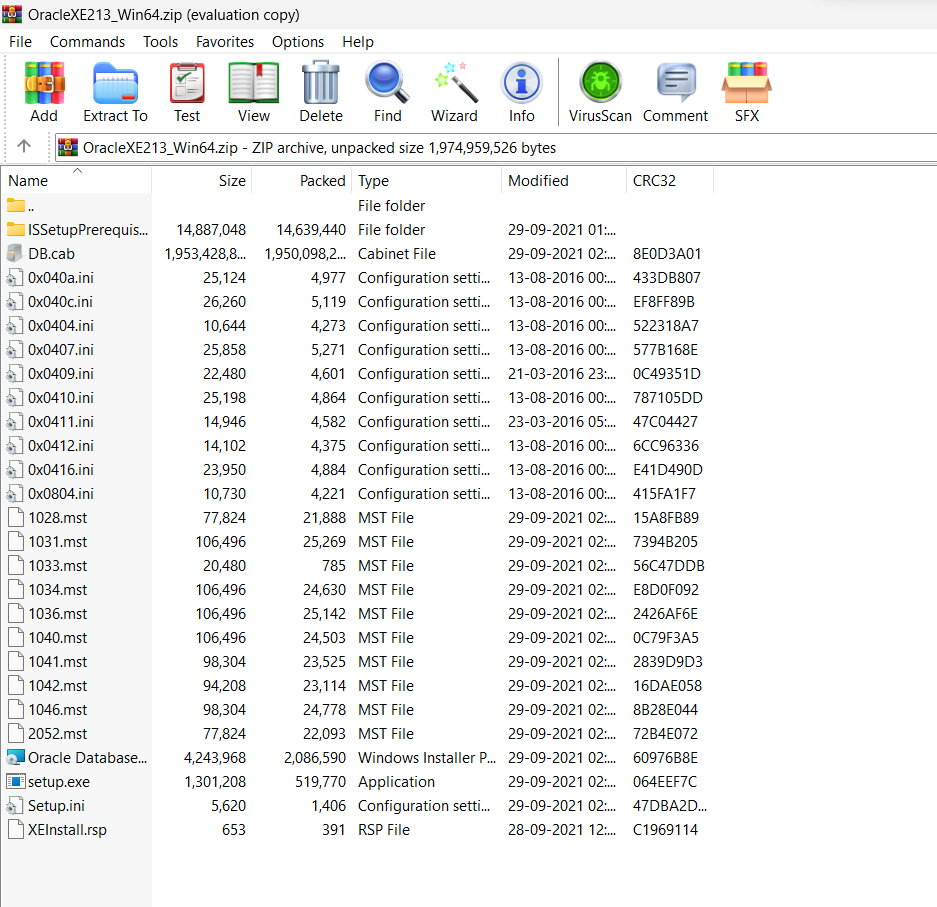

 

<!-- ------------------------------------------- -->
---

### Installation

   * Run 'setup.exe'

   * Put your mouse cursor on the image to see instructions.

* Extracting... wait

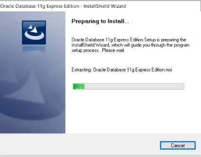

* Accept the agreements

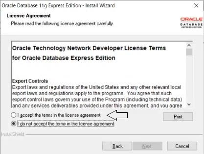

* Remember the password

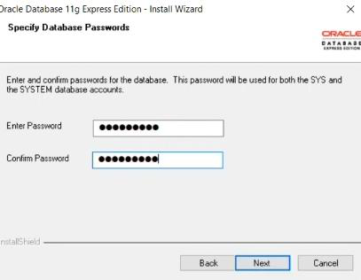

* Click 'Install'

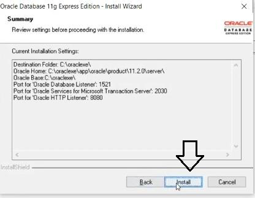

* Loading...Finished

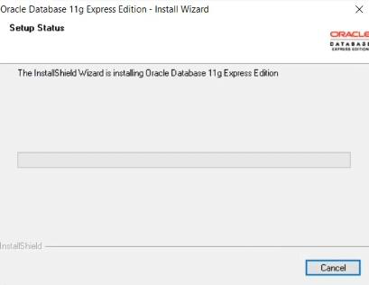

 

<!-- ------------------------------------------- -->

---

### User creation

* Go to 'START' and type 'sql plus'
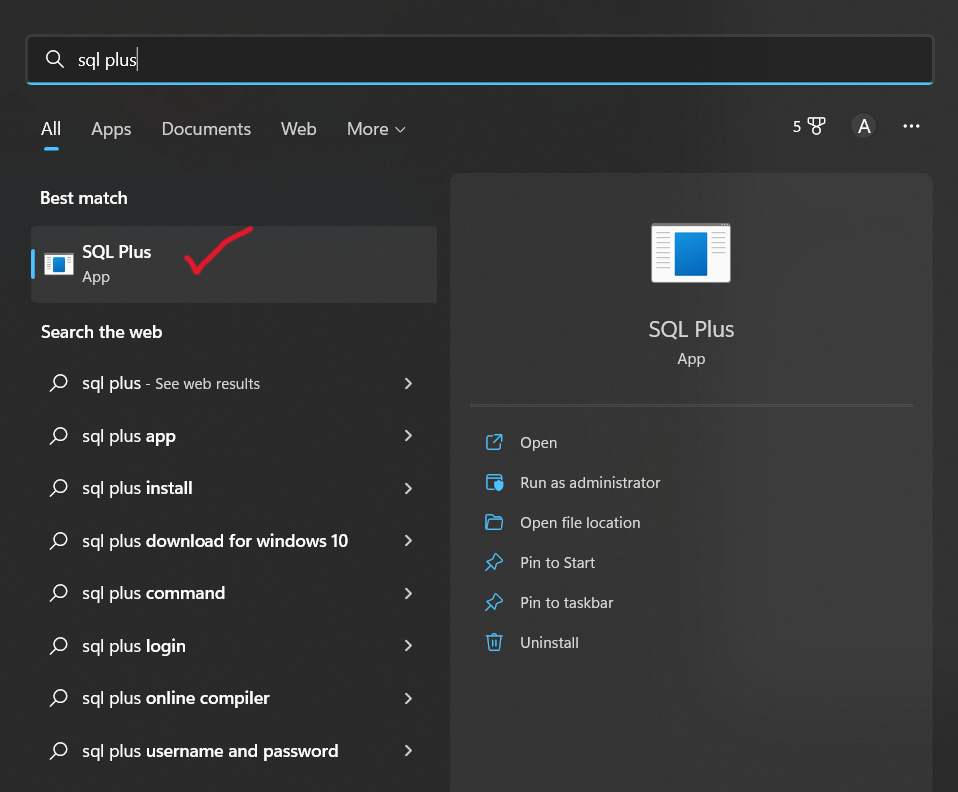

* open the 'sql plus' application & you will see

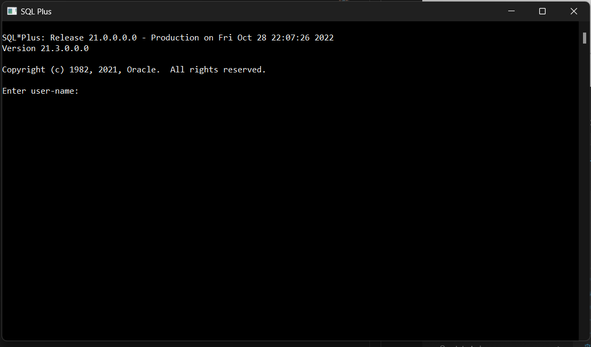

* Type near 'Enter user-name:'

        / as sysdba

* For changing the settings to accept any type of username

        alter session set "_ORACLE_SCRIPT"=true;

* Change _username_ to your username
* Set a good password like '1234' :relieved: 

        create user <username> identified by <password>;

* Change _username_ to your username

        grant unlimited tablespace to <username>;

* Change _username_ to your username

        grant resource, connect, dba to <username>;

* Demo image:

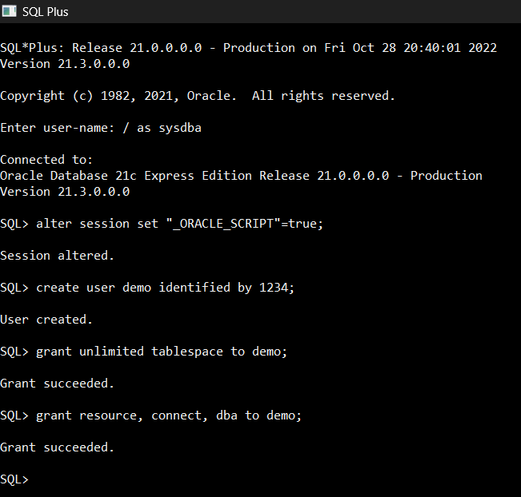

 

<!-- ------------------------------------------- -->

---

### Dropping user

* Drop unwanted users using

        drop user <username>

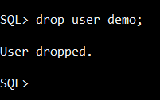

 

<!-- ------------------------------------------- -->

---

### Demo Queries

* Open another 'SQL Plus' tab

* For login, type your username & password

* And, try creating some demo tables & inserting values in it

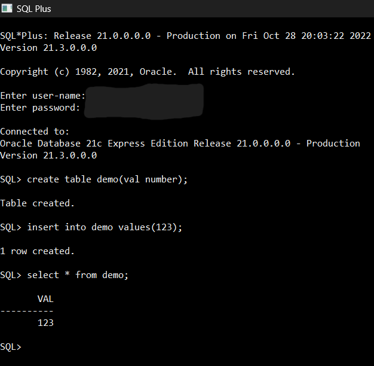

 

<!-- ------------------------------------------- -->

---

### Writing real queries - Click [this](https://github.com/004Ajay/SQL)